# macOS-ThinkPad-X1C6 (OpenCore)

###### 臺灣中文， [Click here for an English guide](./README.md)

### 最新通知

本數據庫的組態設定支援 OpenCore 或 Clover 作為開機載入器，惟說明更新需時，說明更新完成後，將上載至本數據庫。

 

## CLOVER

### 介紹

這數據庫提供於 第六代 ThinkPad X1 Carbon 筆記型電腦安裝 macOS 的資源。由於這些資源並不能保證安裝一定成功，所以如果遇到問題時，請用戶自行於網路上尋找有關資源解決相關問題。安裝 macOS 具有一定風險，請用戶先行備份資料，本人將不會對 參考 本數據庫的任何資源後 而引致的任何後果負責。**只適用於 20KH 機型。**

 

### 目標

- 收集資源以便安裝 macOS 於 第六代 ThinkPad X1 Carbon 上
- 避免我忘記如何在 第六代 ThinkPad X1 Carbon上 安裝 macOS
- 分享資源以便其他用戶也能安裝
- 備份 Clover 開機載入器的設定

 

### 目錄

1. [硬體規格](#硬體規格)
2. [UEFI 韌體設定](#UEFI-韌體設定)
3. [軟體概觀](#軟體概觀)
   1. [相容性](#相容性)
   2. [軟體功能](#軟體功能)
      1. [基本系統功能](#基本系統功能)
      2. [連接端口](#連接端口)
      3. [網絡功能](#網絡功能)
      4. [輸入裝置](#輸入裝置)
      5. [電源管理](#電源管理)
      6. [繪圖及音效](#繪圖及音效)
4. [安裝步驟](#安裝步驟)
5. [More to know](#More-to-know)
6. [Useful utilities](#Useful-utilities)
7. [Credits](#Credits)

 

### 硬體規格

###### **以下是我的 第六代 ThinkPad X1 Carbon 所搭載的硬體規格**

| 元件                        | 型號                                                 |
| --------------------------- | ----------------------------------------------------------- |
| 處理器                   | Intel Core i7-8550U                                         |
| 圖形處理器                    | Intel UHD Graphics 620                                      |
| 記憶體                     | Onboard 16GB LPDDR3 2133MHz                                 |
| 音訊 編解碼器                 | Realtek ALC 285 (ALC3286)                                   |
| 無線廣域網路卡 (WWAN)                        | Sierra Wireless EM7455 (Qualcomm Snapdragon X7 LTE-A Modem) |
| 乙太網路卡 (Ethernet)                | Intel I219V4 PCI Express Gigabit Ethernet                   |
| 無線區域網路-藍芽卡 (Wi-Fi) | Dell DW1560                                                 |
| 藍芽                 | BCM20702A0                                                  |
| 無線區域網路裝置               | Broadcom BCM94352Z                                          |
| SD 讀卡器           | Realtek USB3.0 Card Reader                                  |
| 內建螢幕解析度 | 2560x1440 (2K)                                              |
| UEFI 韌體版本       | 1.43 (N23ET68W)                                             |
| 儲存裝置                     | Samsung 860 EVO M.2. SATA 6Gb/s SSD                         |
| Thunderbolt 控制器      | Intel Alpine Ridge DSL6540 Thunderbolt 3 NHI                |

[返回目錄](#目錄)

 

### UEFI 韌體設定

###### 以下只會列出關鍵設定值，您可以隨意更改UEFI 韌體中的其他設定

| 路徑                                                         | 建議值        | 註解                                                      |
| ------------------------------------------------------------ | ------------ | ------------------------------------------------------------ |
| Config/Network/Wake On LAN                                   | Disabled     | 如果啟用將限制乙太網路速度至最高100Mbps                                |
| Config/USB/USB UEFI BIOS Support                             | Enabled      | 啟用 UEFI USB 開機功能                                         |
| Config/Power/8254 Timer Clock Gating                         | Auto         | -                                                            |
| Config/Power/Sleep State                                     | Linux        | -                                                            |
| Config/Thunderbolt (TM) 3/Thunderbolt Security Level         | No Security  | 如果啟用將無法於 macOS 使用 Thunderbolt 3                                  |
| Config/Thunderbolt (TM) 3/Thunderbolt 3 BIOS Assistant       | Disabled     | 如果啟用將無法於 macOS 使用 Thunderbolt 3                                  |
| Config/Thunderbolt (TM) 3/Support in Pre Boot Environment: Thunderbolt (TM) device | Pre-boot ACL | 如果設置為其他值將無法使用前端 Thuderbolt 3 端口 |
| Security/Intel (R) SGX/ Intel (R) SGX Control                | Disabled     | -                                                            |
| Security/Secure Boot Configuration/SecureBoot                | Disabled     | 如果啟用將無法以 macOS 開機（啟用後執行檔需要經數字簽注後始可執行） |
| Security/Device Guard/Device Guard                           | Disabled     | -                                                            |

[返回目錄](#目錄)

 

### 軟體概觀

#### 相容性

- macOS Mojave
	- 10.14.6
		- 2019-09-04
- macOS Catalina
	- 10.15		
		- 2019-10-06
	- 10.15.1	
		- 2019-10-30
	- 10.15.2
		- 2019-12-18

[返回目錄](#目錄)

 

#### 軟體功能

##### 基本系統功能

| 功能                       | 狀態 | 相依性                                           | 註解                                                         |
| :------------------------- | ---- | ------------------------------------------------ | ------------------------------------------------------------ |
| macOS (10.14.x 或 10.15.x) | ✅    | `VirtualSMC.kext`, `Lilu.kext`,Clover Bootloader | Clover v2.5k R5100                                           |
| iMessage/ FaceTime         | ✅    | Apple 帳戶, 有效的 SMBIOS                        | [SMBIOS 說明](https://www.tonymacx86.com/threads/an-idiots-guide-to-imessage.196827/) |
| App Store                  | ✅    | Apple 帳戶                                       | -                                                            |
| iCloud                     | ✅    | Apple 帳戶                                       | -                                                            |
| Siri                       | ✅    | Apple 帳戶, 正常運作的麥克風                     | `AppleALC.kext`                                              |
| iTunes 影片播放            | ✅    | `WhateverGreen.kext`, Apple ID (*視乎情況*)      | -                                                            |
| 檔案系統 (APFS/HFS+)       | ✅    | SATA M.2. 固態硬碟或相容的 M.2. PCIe 固態硬碟    | 對 NVMe 沒有 電源管理                                        |

##### 連接端口

| 功能 | 狀態 | 相依性 | 註解 |
| :--- | ---- | ------ | ---- |
| Micro SD 讀卡器                 | ✅      | 修改後的 `AppleUSBCardReader.kext`                            | -                                                            |
| USB 3.1                              | ✅      | `USBInjectAll.kext` , `SSDT-UAIC.aml`                        | -                                                            |
| Thunderbolt 3 擴充埠的 DisplayPort   | ✅      | `SSDT-TB3.aml`, `IOElectrify.kext`                           | -                                                            |
| Thunderbolt 3 擴充埠 | ✅      | `SSDT-TB3.aml`, `IOElectrify.kext`                           | -                                                            |
| Thunderbolt 3 熱插拔                | ✅      | `SSDT-TB3.aml`, `IOElectrify.kext`                           | -                                                            |
| Thunderbolt 3 擴充埠的 乙太網路端口           | ✅      | Thunderbolt 3 擴充埠 (40AC型號), `AppleRTL815XComposite109.kext`, `AppleRTL815XEthernet109.kext` | [產品介紹](https://support.lenovo.com/au/zh/solutions/acc100356) |

##### 網絡功能

| 功能                   | 狀態 | 相依性                                                       | 註解                                                    |
| :--------------------- | ---- | ------------------------------------------------------------ | ------------------------------------------------------- |
| AirDrop                | ✅    | `BT4LEContiunityFixup.kext`, 正常運作的藍芽和無線區域網路功能 | -                                                       |
| 藍芽                   | ✅    | `BrcmFirmwareRepo.kext`, `BrcmPatchRAM3.kext`, `BrcmBluetoothInjector.kext` | -                                                       |
| 接續互通 (Continuty)   | ✅    | `BT4LEContiunityFixup.kext`, 正常運作的藍芽和無線區域網路功能 | -                                                       |
| 延伸桌面(Sidecar)      | ✅    | 已安裝iPadOS 13 的 iPad                                      | 於安裝了 iPad OS 13 的 iPad Pro 10.5 上測試過，正常運作 |
| 乙太網路               | ✅    | `IntelMausiEthernet.kext`                                    | -                                                       |
| Wi-Fi                  | ✅    | 把 原廠的無線區域網路 換成 Dell DW1560                       | -                                                       |
| Sierra Wireless EM7455 | ❌    | `Legacy_Sierra_QMI.kext`                                     | 沒有無線廣域網路                                        |

##### 輸入裝置

| 功能 | 狀態 | 相依性 | 註解 |
| :--- | ---- | ------ | ---- |
| 小紅帽 (指點杆) | ✅      | `VoodooPS2Controller.kext`                           | -                                                            |
| 觸控板                             | ✅      | `VoodooPS2Controller.kext`                                   | -                                                            |
| 內建鍵盤                    | ✅      | `VoodooPS2Controller.kext`                                   | -                                                            |

##### 電源管理

| 功能 | 狀態 | 相依性 | 註解 |
| :--- | ---- | ---- | ---- |
| 續航力                        | ✅      | 非 NVMe 的固態硬碟, 正常運作的電源管理功能 (GPU/CPU) | 對輕度上網作業，約每小時下降10%               |
| 電池容量百分比        | ✅      | 修改過的 `DSDT.aml`                                         | 使用 [MaciASL](https://bitbucket.org/RehabMan/os-x-maciasl-patchmatic/downloads/) 修改ACPI表 |
| 處理器 電源管理 (SpeedShift)    | ✅      | `XCPM`                                                       | -                                                            |
| 內建繪圖處理器 電源管理              | ✅      | `XCPM`                                                       | -                                                            |
| 睡眠                                | ❌      | -                                                            | 禁用                                                   |
| 休眠                          | ❌      | -                                                            | 禁用                                                   |

##### 繪圖及音效

| 功能                              | 狀態 | 相依性                                                   | 註解                                                      |
| :----------------------------------- | ------ | ------------------------------------------------------------ | ------------------------------------------------------------ |
| 麥克風                      | ✅      | `AppleALC.kext` with Layout ID = 11                          | -                                                            |
| 揚聲器                       | ✅      | `AppleALC.kext` 的 Layout ID = 11                          | -                                                            |
| 繪圖加速 (QE/CI)  | ✅      | `WhateverGreen.kext`, 經`config.plist`自定義的裝置屬性 | -                                                            |
| HiDPI *(非必須)* | ⚠️ | Shell Script from xzhih [Click Here](https://github.com/xzhih/one-key-hidpi) | 於睡眠後可能有奇怪的解析度問題 |

[返回目錄](#目錄)

 

### 安裝步驟

#### 流程圖

#### STEP 1: Create Installation Media

##### Checklist

- A working computer with macOS (or Mac OS X 10.7 or later) 
- A working computer with Linux
- A working USB drive with 16GB or more capacity
- *Internet connection* (Not required if you already have the installer)
- A copy of macOS installation medium
  - For macOS Mojave click [here](http://dosdude1.com/mojave/) to get the application to download a copy of macOS Mojave installer.
  - For macOS Catalina click [here](http://dosdude1.com/catalina/) to get the application to download a copy of macOS Catalina installer.
  - Download macOS Catalina from the App Store

##### Procedure

###### If you are using macOS

1. Follow the gudie [here](https://support.apple.com/en-us/HT201372)
2. Copy boot files to the USB such that it is bootable on ThinkPad
   1. Mount EFI System partition using `diskutil`
      1. Check the identifier for the EFI System partition of the USB using `diskutil list`
      2. Mount it, e.g. `diskutil mount disk3s1`
      3. You should see a new `EFI` volume appeared in Finder, that is the EFI System partition of the USB.
   2. Copy boot files
      1. Go to the `EFI` folder of this repository
      2. Copy the entire `EFI` Folder to the root of the EFI System partition of the USB.
      3. You have copied the boot files.
   3. Finished. Move on to step 2.

###### If you are using Linux

1. Use the script here: https://github.com/notthebee/macos_usb (Credit: notthebee)

##### STEP 2: Boot into installer

###### Checklist

- A working ThinkPad X1 Carbon 6th Type 20KH
  - **Permission to change boot order**
- A properly created macOS installer in a bootable USB (That you might have created in step 1)

###### Procedure

1. Plug in the USB Installer into the USB 3.0 Type A port of the ThinkPad.
2. Press F12 on your ThinkPad while it boots
3. Select your USB in the boot menu using arrow keys and press `Enter` to boot.
4. You should see a boot menu screen, select an item named 'Install macOS (version name) 'and press `Enter`
   1. `Install macOS Catalina` for macOS Catalina
   2. `Install macOS Mojave` for macOS Mojave
5. You should see long text running in a black background for some time, this is normal.
6. You should see macOS Installer menu, move on to step 3.

##### STEP 3: Partition your disks

###### Checklist

- A working ThinkPad X1 Carbon 6th Type 20KH
  - **Booted to macOS Installer**
- A properly created macOS installer in a bootable USB (That you might have created in step 1)

###### Procedure

1. Open Disk Utility
2. Partition your disks according to your wish and your needs
3. Format the partitions with `APFS` (Apple File System)
4. You have partitioned your disks. Move on to step 4.

##### STEP 4: Begin installation

###### Checklist

- A working ThinkPad X1 Carbon 6th Type 20KH
  - **Booted to macOS Installer**
  - **Created approproiate partitions for macOS installations**
- A properly created macOS installer in a bootable USB (That you might have created in step 1)

###### Procedure

1. Click Install macOS
2. Select the partition that you have created as the destination
3. Click install, the installation will start

###### Remarks

1. Your computer will restart for a few times
2. When the ThinkPad is restarted, repeat Step 2 to continue the installation
3. When the installation is completed, move on to Step 5.

##### STEP 5: Setup macOS

###### Checklist

- A working ThinkPad X1 Carbon 6th Type 20KH
  - **Installed a fresh copy of macOS**
- A properly created macOS installer in a bootable USB (That you might have created in step 1)

###### Procedure

1. Follow on-screen instructions to setup your macOS installation.
2. You should see macOS Desktop when you have finished, move on step 6.

##### STEP 6: Post Install Tweaks

###### Checklist

- Post installation materials
  - Located in `post` folder in this repository
- A working ThinkPad X1 Carbon 6th Type 20KH
  - **Installed macOS**

###### Procedure

1. Install required kernel extensions `kexts`
   1. Get the required materials
      1. Download and Open the `Kext` folder inside `post` folder in this repository
         - `post/Kext`
      2. Download kextbeast
         - Download [here](https://www.tonymacx86.com/resources/kextbeast-2-0-2.399/)
   2. Install the `kexts`
      1. Drag and drop all `kext` files from `post/kext` to your desktop
      2. Open Kextbeast
      3. Select `/Library/Extensions` as the package to install
      4. Click install and wait until a big green tick appeared on screen
      5. You have successfully installed the required kexts
   3. Copy boot files
      1. Mount EFI System partition using `diskutil`
         1. Check the identifier for the EFI System partition of the installation disk using `diskutil list`
         2. Mount it, e.g.`diskutil mount disk0s1`
         3. You should see a new `EFI` volume appeared in Finder, that is the EFI System partition of the installation drive.
      2. Copy boot files
         1. Go to the `EFI` folder of this repository
         2. Copy the entire `EFI` Folder to the root of the EFI System partition of the installation drive.
         3. Configure SMBIOS using the guide here: [Link](https://www.tonymacx86.com/threads/an-idiots-guide-to-imessage.196827/)
            1. System Model should be **MacBookPro14,1**
            	- Reason: To enable HWP for better power management
         4. You have copied the boot files.

[Back to Contents Page](#Contents)

### More to know

- **DSDT Patching guide**
  - Follow guide here: [Link to Tonymacx86](https://www.tonymacx86.com/threads/guide-patching-laptop-dsdt-ssdts.152573/)
  - Patch files: [Link to tylerngyuen's Github repo](https://github.com/tylernguyen/x1c6-hackintosh)
- **iMessage Guide**
  - Follow gudie here: [Link to Tonymacx86](https://www.tonymacx86.com/threads/an-idiots-guide-to-imessage.196827/)
- **Battery life improvement**
  - Follow guide here to enable native CPU/ GPU Power Management: [Link to Tonymacx86](https://www.tonymacx86.com/threads/guide-native-power-management-for-laptops.175801/)
    - The CPU / GPU Power management is archieved by `CPUFriend.kext` and `CPUFriendDataProvider.kext` in my setup.
  - Do not use NVMe (PCIe) SSD for Hackintosh if you care about battery life
- **ThinkPad Thunderbolt 3 Dock (Type 40AC) Tweaks**
  - Download the requried software for working Ethernet
    - Link here: [Click me](https://gist.github.com/MadLittleMods/3005bb13f7e7178e1eaa9f054cc547b0)
- **Thunderbolt Tweaks**
	- Principles and patching guide
		- Link here: [Click me](https://osy.gitbook.io/hac-mini-guide/details/thunderbolt-3-fix)
	- SSDT
		- Link here: [Click me](https://www.tonymacx86.com/threads/in-progress-ssdt-for-thunderbolt-3-hotplug.248784/)
	- IOElectrify for hot plugging support
		- Link here: [Click me](https://github.com/the-darkvoid/macOS-IOElectrify)
- **If you have other other suggestions**
  - Talk on Github

[Back to Contents Page](#Contents)

 

### Useful utilities

- [Hackintool](https://www.tonymacx86.com/threads/release-hackintool-v2-8-0.254559/)
- [Kext Updater](https://www.insanelymac.com/forum/topic/334222-kext-updater-keep-your-kexts-fresh-with-only-one-click/)
- [Kext Beast](https://www.tonymacx86.com/resources/kextbeast-2-0-2.399/)
- [Clover Configurator](https://mackie100projects.altervista.org/download-clover-configurator/)
- [MaciASL](https://bitbucket.org/RehabMan/os-x-maciasl-patchmatic/downloads/)

[Back to Contents Page](#Contents)

 

### Credits

- Rehabman for most of the resources and guides
- Tonymacx86 as a discussion platform and hosts most resources
- P1LGRIM an iDiot's guide for iMessage, Link: [iDiot's guide for iMessage](https://www.tonymacx86.com/threads/an-idiots-guide-to-imessage.196827/)
- tylerngyuen for ACPI patch files, Link: [tylernguyen](https://github.com/tylernguyen)/[x1c6-hackintosh](https://github.com/tylernguyen/x1c6-hackintosh)
- LeleTuratti for Thunderbolt 3 SSDT, Link: [[In progress] SSDT for Thunderbolt 3 Hotplug](https://www.tonymacx86.com/threads/in-progress-ssdt-for-thunderbolt-3-hotplug.248784/)
- The darkvoid for macOS-IOElectrify, Link: [macOS-IOElectrify](https://github.com/the-darkvoid/macOS-IOElectrify)
- HaC Mini Hackintosh for Thunderbolt 3 Fix, Link: [Thunderbolt 3 Fix (Part 1)](https://osy.gitbook.io/hac-mini-guide/details/thunderbolt-3-fix)
- noobsplanet for Internal SD Card reader patch, Link: [Internal SD Card reader patch](https://noobsplanet.com/index.php?threads/fix-internal-external-card-reader-hackintosh-guide.32/)
- MadLittleMods for Ethernet on ThinkPad Thunderbolt 3 dock, Link: [realtek-rtl-8153-driver-osx-info.md](https://gist.github.com/MadLittleMods/3005bb13f7e7178e1eaa9f054cc547b0)
- acidanthera for AppleALC, Link: [AppleALC](https://github.com/acidanthera/AppleALC)
- PMHeart for LiluFriend, Link: [LiluFriend](https://github.com/PMheart/LiluFriend)
- acidanthera for Lilu, Link: [Lilu](https://github.com/acidanthera/Lilu)
- acidanthera for BrcmPatchRAM, Link: [BrcmPatchRAM](https://github.com/acidanthera/BrcmPatchRAM)
- acidanthera for WhateverGreen, Link: [WhateverGreen](https://github.com/acidanthera/WhateverGreen)
- xzhih for one-key-hidpi, Link: [one-key-hidpi](https://github.com/xzhih/one-key-hidpi)
- headkaze for Hackintool, Link: [Hackintool](https://www.tonymacx86.com/threads/release-hackintool-v2-8-0.254559/)
- Sascha77 for Kext Updater, Link: [Kext Updater](https://www.insanelymac.com/forum/topic/334222-kext-updater-keep-your-kexts-fresh-with-only-one-click/)
- MacMan for Kext Beast, Link: [Kext Beast](https://www.tonymacx86.com/resources/kextbeast-2-0-2.399/)
- Mackie100 for Clover Configurator, Link: [Clover Configurator](https://mackie100projects.altervista.org/download-clover-configurator/)
- notthebee for macOS USB Creator, Link: [macos_usb](https://github.com/notthebee/macos_usb)
- All contributors in the hackintosh community

[Back to Contents Page](#Contents)

 

Last update: 2020-01-05

