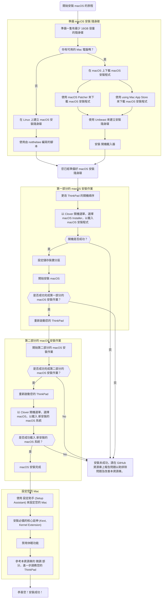

```mermaid
  graph TB;

    begin("開始安裝 macOS 的旅程")-->getUSB
    sorry["安裝未成功，請在 GitHub 資源庫上報告問題以助排除問題及改善本資源庫。"]

    subgraph 準備 macOS 安裝 隨身碟
      getUSB-->hvmac?
      hvmac?{{"你有可用的 Mac 電腦嗎？"}}
      getInstaller["在 macOS 上下載 macOS 安裝程式"]
      getInstallerLinux["在 Linux 上建立 macOS 安裝隨身碟"]
      dosdude["使用 macOS Patcher 來下載 macOS 安裝程式"]
      mas["使用 using Mac App Store 來下載 macOS 安裝程式"]
      getUSB["準備一隻有最少 16GB 容量的隨身碟"]
      thankyou["使用由 notthebee 編寫的腳本"]
      createUSBmacOS["使用 Unibeast 來建立安裝隨身碟"]
      installClover["安裝 開機載入器"]

      hvmac?-->|是|getInstaller
      hvmac?-->|否|getInstallerLinux
      getInstallerLinux-->thankyou
      getInstaller-->dosdude
      getInstaller-->mas
      dosdude-->createUSBmacOS
      mas-->createUSBmacOS
      createUSBmacOS-->installClover
    end

    thankyou-->finish
    installClover-->finish
    finish("您已經準備好 macOS 安裝隨身碟")
    finish-->changeBootOrder

    subgraph 第一部分的 macOS 安裝作業
      changeBootOrder["更改 ThinkPad 的開機順序"]
      bootInstaller["以 Clover 開機選單，選擇 macOS Installer，以載入macOS 安裝程式"]
      bootSuccess?{{"開機是否成功？"}}

      partition["設定儲存裝置分區"]
      startInstall["開始安裝 macOS"]
      installresult?{{"是否成功完成第一部分的 macOS 安裝作業？"}}
      reboot["重新啟動您的 ThinkPad"]

      changeBootOrder-->bootInstaller
      bootInstaller-->bootSuccess?
      bootSuccess?-->|是|partition

      partition-->startInstall
      startInstall-->installresult?

    end
    bootSuccess?-->|否|sorry
    installresult?-->|否|sorry
    installresult?-->|是|reboot
    reboot["重新啟動您的 ThinkPad"]
    reboot-->startInstall2

    subgraph 第二部分的 macOS 安裝作業
      startInstall2["開始第二部分的 macOS 安裝作業"]
      install2result?{{"是否成功完成第二部分的 macOS 安裝作業？"}}
      reboot2["重新啟動您的 ThinkPad"]
      bootmac["以 Clover 開機選單，選擇 macOS，以載入 新安裝的 macOS 系統"]
      boot2success?{{"是否成功載入 新安裝的 macOS 系統？"}}
      startInstall2-->install2result?
      install2result?-->|是|reboot2
      reboot2-->bootmac
      bootmac-->boot2success?
      boot2success?-->|是|installSuccess

    end

    installSuccess-->setupMac

    subgraph 設定您的 Mac
      setupMac["使用 設定助手 (Setup Assistant) 來設定您的 Mac"]
      installKext["安裝必備的核心延伸 (Kext, Kernel Extension)"]
      disableHibernate["禁用休眠功能"]
      fineTune["參考本資源庫的 微調 部分，進一步調教您的 ThinkPad"]
      setupMac-->installKext
      installKext-->disableHibernate
      disableHibernate-->fineTune

    end

    complete["恭喜您！安裝成功！"]
    fineTune-->complete

    boot2success?-->|No|sorry
    install2result?-->|No|sorry
    installSuccess["macOS 安裝完成"]
```

