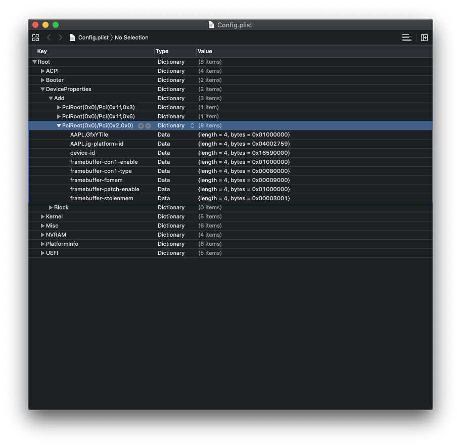
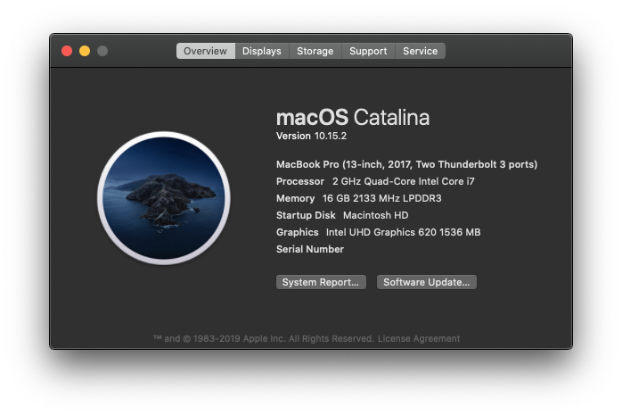
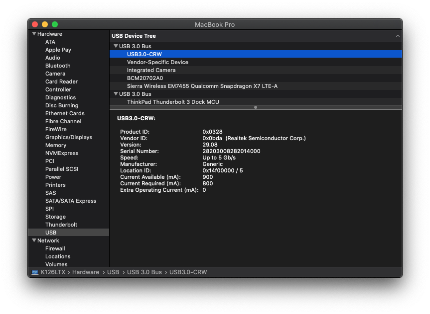
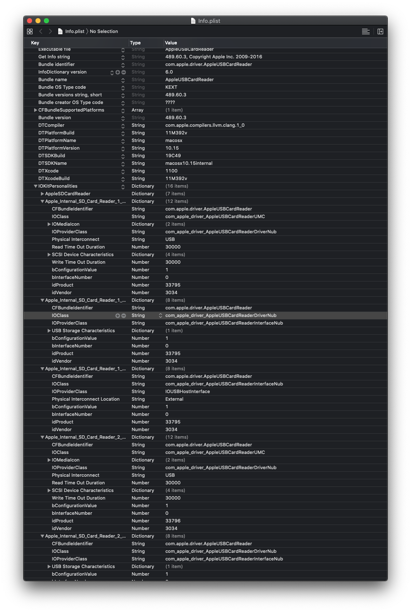
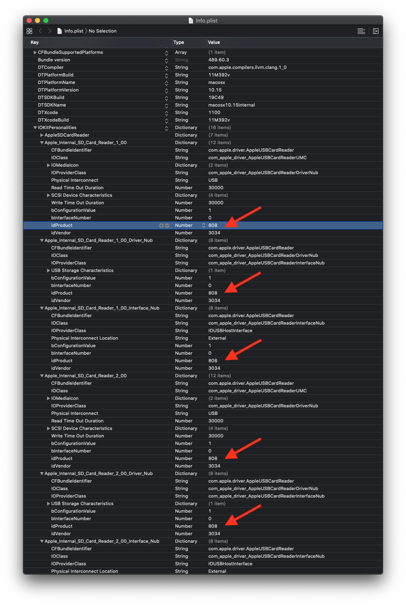

# macOS-ThinkPad-X1C6 (OpenCore)

> US English, [中文版請見此](./README-TW.md)

### Notice

The README.md guide for OpenCore is being worked on. It will be published once the README.md for OpenCore is ready.

Last update: 2020-01-12 (Taipei Time)


## OpenCore	

### Introduction

This repository provides some necessary resources to install a copy of macOS on ThinkPad X1 Carbon 6th.
There is no guarantee of success, therefore you are expected to find extra resources to meet your needs, and be responsible for any consequences. **For Machine Type 20KH Only**.


### Objective

- Gather resources for a successful macOS installation on ThinkPad X1 Carbon 6th
- To prevent myself from forgetting how to instal macOS on ThinkPad X1 Carbon 6th
- To share the resources for others who might want to do the same thing
- To get used to OpenCore bootloader and port OpenCore configuration to other machines


### Contents

1. [Hardware Specifications](#Hardware-Specifications)
2. [UEFI Setup Configuration](#UEFI-Setup-Configuration)
3. [Software Overview](#Software-Overview)
   1. [Guide Compatibility](#Compatibility)
   2. [Features](#Features)
      1. [Base System](#Base-System)
      2. [Connectivity](#Connectivity)
      3. [Networking](#Networking)
      4. [Human Interface Devices](#Human-Interface-Devices)
      5. [Power Management](#Power-Management)
      6. [Audio and Graphics](#Audio-and-Graphics)
4. [General installation procedure](#General-installation-procedure)
5. [More to know](#More-to-know)
6. [Useful utilities](#Useful-utilities)
7. [Credits](#Credits)


### Hardware Specifications

**This is the hardware specification of my ThinkPad X1 Carbon 6th.**

| Item                        | Description                                                 |
| --------------------------- | ----------------------------------------------------------- |
| Processor                   | Intel Core i7-8550U                                         |
| Graphics                    | Intel UHD Graphics 620                                      |
| Memory                      | Onboard 16GB LPDDR3 2133MHz                                 |
| Audio Codec                 | Realtek ALC 285 (ALC3286)                                   |
| WWAN                        | Sierra Wireless EM7455 (Qualcomm Snapdragon X7 LTE-A Modem) |
| PCI Ethernet                | Intel I219V4 PCI Express Gigabit Ethernet                   |
| WLAN/ Bluetooth Module      | Dell DW1560                                                 |
| Bluetooth                   | BCM20702A0                                                  |
| Wi-Fi                       | Broadcom BCM94352Z                                          |
| Media Card Reader           | Realtek USB3.0 Card Reader                                  |
| Built-in Display Resolution | 2560x1440 (2K)                                              |
| UEFI Firmware Version       | 1.43 (N23ET68W)                                             |
| Storage                     | Samsung 860 EVO M.2. SATA 6Gb/s SSD                         |
| Thunderbolt Controller      | Intel Alpine Ridge DSL6540 Thunderbolt 3 NHI                |

[Back to Contents Page](#Contents)


### UEFI Setup Configuration

**Only listing values that matters. Feel free to configure other values to suit your needs.**

| Path                                                         | Value        | Remarks                                                      |
| ------------------------------------------------------------ | ------------ | ------------------------------------------------------------ |
| Config/Network/Wake On LAN                                   | Disabled     | Only 100M Ethernet if enabled                                |
| Config/USB/USB UEFI BIOS Support                             | Enabled      | Enable UEFI USB boot                                         |
| Config/Power/8254 Timer Clock Gating                         | Auto         | -                                                            |
| Config/Power/Sleep State                                     | Linux        | -                                                            |
| Config/Thunderbolt (TM) 3/Thunderbolt Security Level         | No Security  | No Thunderbolt 3 if enabled                                  |
| Config/Thunderbolt (TM) 3/Thunderbolt 3 BIOS Assistant       | Disabled     | No Thunderbolt 3 if enabled                                  |
| Config/Thunderbolt (TM) 3/Support in Pre Boot Environment: Thunderbolt (TM) device | Pre-boot ACL | No Front Thunderbolt 3 (Type-C port) if changed to other values |
| Security/Intel (R) SGX/ Intel (R) SGX Control                | Disabled     | -                                                            |
| Security/Secure Boot Configuration/SecureBoot                | Disabled     | Unable to boot macOS if enabled (Requires digitally signed executables) |
| Security/Device Guard/Device Guard                           | Disabled     | -                                                            |

[Back to Contents Page](#Contents)


### Software Overview

#### Compatibility

- macOS Mojave
	- 10.14.6
		- 2019-09-04
- macOS Catalina
	- 10.15		
		- 2019-10-06
	- 10.15.1	
		- 2019-10-30
	- 10.15.2
		- 2019-12-18

[Back to Contents Page](#Contents)

#### Features

##### Base System

| Feature                    | Status | Dependency                                        | Remarks                                                      |
| :------------------------- | ------ | ------------------------------------------------- | ------------------------------------------------------------ |
| macOS (10.14.x or 10.15.x) | ✅      | `VirtualSMC.kext`, `Lilu.kext`, Clover Bootloader | Clover v2.5k R5100                                           |
| iMessage/ FaceTime         | ✅      | Apple ID, Valid SMBIOS                            | [Guide](https://www.tonymacx86.com/threads/an-idiots-guide-to-imessage.196827/) |
| App Store                  | ✅      | Apple ID                                          | -                                                            |
| iMessage/ FaceTime         | ✅      | Apple ID, Valid SMBIOS                            | [Guide](https://www.tonymacx86.com/threads/an-idiots-guide-to-imessage.196827/) |
| iCloud                     | ✅      | Apple ID                                          | -                                                            |
| Siri                       | ✅      | Apple ID, Working audio recorder                  | Needs `AppleALC.kext`                                        |
| iTunes Video Playback      | ✅      | `WhateverGreen.kext`, Apple ID (*Optional*)       | -                                                            |
| Filesystem (APFS/HFS+)     | ✅      | Use SATA M.2. SSD or a Compatiable M.2. PCIe SSD  | No NVMe Power Management                                     |

<hr>

##### Connectivity

| Feature                              | Status | Dependency                                                   | Remarks                                                      |
| :----------------------------------- | ------ | ------------------------------------------------------------ | ------------------------------------------------------------ |
| Micro SD Card Reader                 | ✅      | Patched `AppleUSBCardReader.kext`                            | -                                                            |
| USB 3.1                              | ✅      | `USBInjectAll.kext` , `SSDT-UAIC.aml`                        | -                                                            |
| DisplayPort on Thunderbolt 3 Dock    | ✅      | `SSDT-TB3.aml`, `IOElectrify.kext`                           | -                                                            |
| Thunderbolt 3 Dock (Port Replicator) | ✅      | `SSDT-TB3.aml`, `IOElectrify.kext`                           | -                                                            |
| Thunderbolt 3 Hotplug                | ⚠️      | `SSDT-TB3.aml`, `IOElectrify.kext`                           | Only the Type-C port next to the ethernet port supports hot-plugging |
| Wake on LAN                          | ✅      | `IntelMausiEthernet.kext` included in this repo (I re-compiled it to support WoL) | -                                                            |
| ThinkPad TB3 Dock Ethernet           | ✅      | ThinkPad Thunderbolt 3 Dock (40AC), `AppleRTL815XComposite109.kext`, `AppleRTL815XEthernet109.kext` | [Item page](https://support.lenovo.com/au/en/solutions/acc100356) |

<hr>

##### Networking

| Feature                | Status | Dependency                                                   | Remarks                                 |
| :--------------------- | ------ | ------------------------------------------------------------ | --------------------------------------- |
| AirDrop                | ✅      | `BT4LEContiunityFixup.kext`, Working Blutetooth and WiFi setup | -                                       |
| Bluetooth              | ✅      | `BrcmFirmwareRepo.kext`, `BrcmPatchRAM3.kext`, `BrcmBluetoothInjector.kext` | -                                       |
| Continuty              | ✅      | `BT4LEContiunityFixup.kext`, Working Blutetooth and WiFi setup | -                                       |
| Sidecar                | ✅      | iPad with iPadOS 13                                          | Tested with iPad Pro with iPadOS 13.1.2 |
| PCIe Ethernet          | ✅      | `IntelMausiEthernet.kext`                                    | -                                       |
| Wi-Fi                  | ✅      | Swapping Intel WLAN card with  Dell DW1560, `AirportBrcmFixup.kext`, `Lilu.kext` | -                                       |
| Sierra Wireless EM7455 | ❌      | `Legacy_Sierra_QMI.kext`                                     | No internet                             |

<hr>

##### Human Interface Devices

| Feature           | Status | Dependency                         | Remarks |
| :---------------- | ------ | ---------------------------------- | ------- |
| TrackPoint        | ✅      | Patched `VoodooPS2Controller.kext` | -       |
| TrackPad          | ✅      | `VoodooPS2Controller.kext`         | -       |
| Built-in Keyboard | ✅      | `VoodooPS2Controller.kext`         | -       |

<hr>

##### Power Management

| Feature                           | Status | Dependency                                                   | Remarks                                                      |
| :-------------------------------- | ------ | ------------------------------------------------------------ | ------------------------------------------------------------ |
| Battery life                      | ✅      | Non-NVME SSD, proper power management setup (CPU Power Management, GPU Power Management) | Drops 10% per hour for light programming tasks               |
| Battery Percentage Indication     | ✅      | Patched `DSDT.aml`                                           | Use [MaciASL](https://bitbucket.org/RehabMan/os-x-maciasl-patchmatic/downloads/) |
| CPU Power Management (SpeedShift) | ✅      | `XCPM`                                                       | -                                                            |
| IGPU Power Management             | ✅      | `XCPM`                                                       | -                                                            |
| Hibernation                       | ❌      | -                                                            | Disabled                                                     |
| Sleep                             | ❌      | -                                                            | Disabled                                                     |

<hr>

##### Audio and Graphics

| Feature                           | Status | Dependency                                                   | Remarks                                     |
| :-------------------------------- | ------ | ------------------------------------------------------------ | ------------------------------------------- |
| Audio Recording                   | ✅      | `AppleALC.kext` with Layout ID = 11                          | -                                           |
| Audio Playback                    | ✅      | `AppleALC.kext` with Layout ID = 11                          | -                                           |
| Full Graphics Accleration (QE/CI) | ✅      | `WhateverGreen.kext`, Custom device properties in `config.plist` | -                                           |
| HiDPI *(Optional)*                | ⚠️      | Shell Script from xzhih [Click Here](https://github.com/xzhih/one-key-hidpi) | May have werid scaling issues after wake up |

[Back to Contents Page](#Contents)

<hr>

### General installation procedure

#### Flowchart



<hr>

#### Step by Step Procedure

##### STEP 1: Create Installation Media

##### Checklist

- A working computer with macOS (or Mac OS X 10.7 or later) 
- A working computer with Linux
- A working USB drive with 16GB or more capacity
- *Internet connection* (Not required if you already have the installer)
- A copy of macOS installation medium
  - For macOS Mojave click [here](http://dosdude1.com/mojave/) to get the application to download a copy of macOS Mojave installer.
  - For macOS Catalina click [here](http://dosdude1.com/catalina/) to get the application to download a copy of macOS Catalina installer.
  - Download macOS Catalina from the App Store

##### Procedure

###### If you are using macOS

1. Follow the gudie [here](https://support.apple.com/en-us/HT201372)
2. Copy boot files to the USB such that it is bootable on ThinkPad
   1. Mount EFI System partition using `diskutil`
      1. Check the identifier for the EFI System partition of the USB using `diskutil list`
      2. Mount it, e.g. `diskutil mount disk3s1`
      3. You should see a new `EFI` volume appeared in Finder, that is the EFI System partition of the USB.
   2. Copy boot files
      1. Go to the `EFI` folder of this repository
      2. Copy the entire `EFI` Folder to the root of the EFI System partition of the USB.
      3. You have copied the boot files.
   3. Finished. Move on to step 2.

###### If you are using Linux

1. Use the script here: https://github.com/notthebee/macos_usb (Credit: notthebee)

<hr>

##### STEP 2: Boot into installer

###### Checklist

- A working ThinkPad X1 Carbon 6th Type 20KH
  - **Permission to change boot order**
- A properly created macOS installer in a bootable USB (That you might have created in step 1)

###### Procedure

1. Plug in the USB Installer into the USB 3.0 Type A port of the ThinkPad.
2. Press F12 on your ThinkPad while it boots
3. Select your USB in the boot menu using arrow keys and press `Enter` to boot.
4. You should see a boot menu screen, select an item named 'Install macOS (version name) 'and press `Enter`
   1. `Install macOS Catalina` for macOS Catalina
   2. `Install macOS Mojave` for macOS Mojave
5. You should see long text running in a black background for some time, this is normal.
6. You should see macOS Installer menu, move on to step 3.

<hr>

##### STEP 3: Partition your disks

###### Checklist

- A working ThinkPad X1 Carbon 6th Type 20KH
  - **Booted to macOS Installer**
- A properly created macOS installer in a bootable USB (That you might have created in step 1)

###### Procedure

1. Open Disk Utility
2. Partition your disks according to your wish and your needs
3. Format the partitions with `APFS` (Apple File System)
4. You have partitioned your disks. Move on to step 4.

<hr>

##### STEP 4: Begin installation

###### Checklist

- A working ThinkPad X1 Carbon 6th Type 20KH
  - **Booted to macOS Installer**
  - **Created approproiate partitions for macOS installations**
- A properly created macOS installer in a bootable USB (That you might have created in step 1)

###### Procedure

1. Click Install macOS
2. Select the partition that you have created as the destination
3. Click install, the installation will start

###### Remarks

1. Your computer will restart for a few times
2. When the ThinkPad is restarted, repeat Step 2 to continue the installation
3. When the installation is completed, move on to Step 5.

<hr>

##### STEP 5: Setup macOS

###### Checklist

- A working ThinkPad X1 Carbon 6th Type 20KH
  - **Installed a fresh copy of macOS**
- A properly created macOS installer in a bootable USB (That you might have created in step 1)

###### Procedure

1. Follow on-screen instructions to setup your macOS installation.
2. You should see macOS Desktop when you have finished, move on step 6.

<hr>

##### STEP 6: Post Install Tweaks

###### Checklist

- Post installation materials
  - Located in `post` folder in this repository
- A working ThinkPad X1 Carbon 6th Type 20KH
  - **Installed macOS**

###### Procedure

1. Install required kernel extensions `kexts`
   1. Get the required materials
      1. Download and Open the `Kext` folder inside `post` folder in this repository
         - `post/Kext`
      2. Download kextbeast
         - Download [here](https://www.tonymacx86.com/resources/kextbeast-2-0-2.399/)
   2. Install the `kexts`
      1. Drag and drop all `kext` files from `post/kext` to your desktop
      2. Open Kextbeast
      3. Select `/Library/Extensions` as the package to install
      4. Click install and wait until a big green tick appeared on screen
      5. You have successfully installed the required kexts
   3. Copy boot files
      1. Mount EFI System partition using `diskutil`
         1. Check the identifier for the EFI System partition of the installation disk using `diskutil list`
         2. Mount it, e.g.`diskutil mount disk0s1`
         3. You should see a new `EFI` volume appeared in Finder, that is the EFI System partition of the installation drive.
      2. Copy boot files
         1. Go to the `EFI` folder of this repository
         2. Copy the entire `EFI` Folder to the root of the EFI System partition of the installation drive.
         3. Configure SMBIOS using the guide here: [Link](https://www.tonymacx86.com/threads/an-idiots-guide-to-imessage.196827/)
            1. System Model should be **MacBookPro14,1**
            	- Reason: To enable HWP for better power management
         4. You have copied the boot files.


[Back to Contents Page](#Contents)

<hr>

### Fine-tuning your "MacBook"

#### iMessage Guide

iMessage Guide: [Link to Tonymacx86](https://www.tonymacx86.com/threads/an-idiots-guide-to-imessage.196827/)

<hr>

#### Battery life improvement

- Basic concepts of Laptop CPU/GPU Power Management
  - Link Here: [Tonymacx86](https://www.tonymacx86.com/threads/guide-native-power-management-for-laptops.175801/)
- 
- Do not use NVMe (PCIe) SSD for Hackintosh if you care about battery life

<hr>

#### ThinkPad Thunderbolt 3 Dock (Type 40AC) Tweaks

  - Ethernet drivers for Ethernet on 40AC Dock
    - Link here: [Github Gist](https://gist.github.com/MadLittleMods/3005bb13f7e7178e1eaa9f054cc547b0)

<hr>

#### Thunderbolt Tweaks

- Principles and patching guide
		- Link here: [OSY Gitbook](https://osy.gitbook.io/hac-mini-guide/details/thunderbolt-3-fix)
	- Thunderbolt 3 SSDT
		- Link here: [Tonymacx86](https://www.tonymacx86.com/threads/in-progress-ssdt-for-thunderbolt-3-hotplug.248784/)
	- IOElectrify for hot plugging support
		- Link here: [macOS-IOElectrify](https://github.com/the-darkvoid/macOS-IOElectrify)

<hr>

#### Configuring EC and USB Power

  1. Create USB Map, test EC configuration
     1. Link to the guide here: [USBMap](https://github.com/corpnewt/USBMap)

<hr>

#### Graphics fix on macOS

  1. Know your hardware, the following configuration is tested for the following CPUs only

     1. Intel Core i7-8650U *(Intel UHD 620)*
     2. Intel Core i7-8550U *(Intel UHD 620)*

  2. Use [WhateverGreen](#https://github.com/acidanthera/AppleALC)

  3. In Config.plist/DeviceProperties/Add/PciRoot(0x0)/Pci(0x2,0x0), add the following

     | Key                        | Type | Value      |
     | -------------------------- | ---- | ---------- |
     | `AAPL,GfxYTile`            | Data | `01000000` |
     | `AAPL,ig-platform-id`      | Data | `04002759` |
     | `device-id`                | Data | `16590000` |
     | `framebuffer-con1-enable`  | Data | `01000000` |
     | `framebuffer-con1-type`    | Data | `00080000` |
     | `framebuffer-fbmem`        | Data | `00009000` |
     | `framebuffer-patch-enable` | Data | `01000000` |
     | `framebuffer-stolenmem`    | Data | `00003001` |

  4. Result (Xcode as plist editor)

  5. Reboot

<hr>

#### USB SD Card Reader patch

  - Dependency

    1. Configuring EC and USBX Power
    2. All USB ports injected

  - Original Guide for the [patch](https://noobsplanet.com/index.php?threads/fix-internal-external-card-reader-hackintosh-guide.32/)

  - Gather Information

    1. Open System Report in About this Mac

    2. Go to Hardware/USB/USB3.0-CRW

    3. Pay attention to Product ID and Vendor ID, convert them to decimal

       | Item       | Value (Hex) | Value (Dec) |
       | ---------- | ----------- | ----------- |
       | Product ID | 0x0328      | 808         |
       | Vendor ID  | 0x0bda      | 3034        |

    4. Update `idVendor` and `idProduct` in `Apple_internal_SD_Card_Reader_1_00` and `Apple_internal_SD_Card_Reader_2_00` dictionary found in `/System/Library/Extensions/AppleStorageDrivers.kext/Contents/PlugIns/AppleUSBCardReader.kext/Contents/Info.plist`.

       1. Before 
       2. After

    5. Update `Physical Interconnect Location` field from `Internal` to `External` in `Apple_internal_SD_Card_Reader_1_00` and `Apple_internal_SD_Card_Reader_2_00` dictionary found in `/System/Library/Extensions/AppleStorageDrivers.kext/Contents/PlugIns/AppleUSBCardReader.kext/Contents/Info.plist`.

    6. Run the following in terminal

       ```shell
       sudo kextcache -v -i /
       ```

    7. Reboot

<hr>

#### If you have other suggestions

Feel free to open an issue on Github.

[Back to Contents Page](#Contents)

<hr>

### List of kexts and their purposes

/L/E stands for /Library/Extensions

EFI stands for EFI/OC/Kexts and an entry in Config.plist/Kernel/Add

/L/E or EFI stands for those kexts can be installed in either location


| Kext name                  | Purpose                                             | Arguments                                                    | Location    |
| -------------------------- | --------------------------------------------------- | ------------------------------------------------------------ | ----------- |
| AirportBrcmFixup.kext      | Enable DW1560 Wi-Fi function                        | -                                                            | /L/E        |
| AppleALC.kext              | Enabling sound                                      | APPL,layout-id=11                                            | /L/E or EFI |
| BT4LEContinuityFixup.kext  |                                                     |                                                              | /L/E        |
| BrcmBluetoothInjector.kext | Enabling bluetooth                                  | -                                                            | EFI         |
| BrcmFirmwareData.kext      | Enabling bluetooth                                  | -                                                            | EFI         |
| BrcmPatchRAM3.kext         | Enabling bluetooth                                  | -                                                            | EFI         |
| CPUFriend.kext             | CPU Power Management                                | -                                                            | /L/E or EFI |
| CPUFriendDataProvider.kext | Customize CPU Power Management  Scheme              | Configured by: [one-key-cpufriend](https://github.com/stevezhengshiqi/one-key-cpufriend) | /L/E or EFI |
| HibernationFixup.kext      | Eliminate sleep wake issues                         | -                                                            | /L/E        |
| IntelMausiEthernet.kext    | Enabling PCI Ethernet and Wake on Lan               | -                                                            | /L/E or EFI |
| IOElectrify.kext           | Enabling thunderbolt 3 Hotplug                      | -                                                            | /L/E or EFI |
| Lilu.kext                  | Kext patcher                                        | Lilu plugins                                                 | /L/E or EFI |
| NoTouchID.kext             | Prevent password prompt delays                      | -                                                            | /L/E        |
| SMCBatteryManager.kext     | SMC Emulation                                       | -                                                            | /L/E or EFI |
| SMCLightSensor.kext        | SMC Emulation                                       | -                                                            | /L/E or EFI |
| SMCProcessor.kext          | SMC Emulation                                       | -                                                            | /L/E or EFI |
| SMCSuperIO.kext            | SMC Emulation                                       | -                                                            | /L/E or EFI |
| Thunderbolt3Unblocker.kext | Allow all thunderbolt 3 devices to be used          | -                                                            | /L/E        |
| USBInjectAll.kext          | Inject all usuable USB ports on macOS               | SSDT-UIAC.aml                                                | /L/E or EFI |
| USBMap.kext                |                                                     | Configured by: [USBMap](https://github.com/corpnewt/USBMap)  | /L/E or EFI |
| VirtualSMC.kext            | SMC Emulation                                       | -                                                            | /L/E or EFI |
| VoodooInput.kext           | TrackPad gesture recognization                      | Configured by SSDT-X1-`Carbon-Trackpoint.aml`, `SSDT-Keyboard-X1C6.aml` | /L/E or EFI |
| VoodooPS2Controller.kext   | Enabling Built-in Keyboard, TrackPoint and TrackPad | -                                                            | /L/E or EFI |
| WhateverGreen.kext         | Fixes Graphics problems in macOS                    | Device properties in Config.plist                            | /L/E or EFI |

<br>

### List of SSDTs and their purposes

| SSDT                          | Purpose                                                     |
| ----------------------------- | ----------------------------------------------------------- |
| SSDT-ALS0.aml                 | Creates emulated light sensor to save Backlight information |
| SSDT-BATT.aml                 | Enable battery percentage indication                        |
| SSDT-DMAC.aml                 | Expose DMA Controller on macOS (More like real Mac)         |
| SSDT-EC.aml                   | Configures Embedded Controller, related to USB power        |
| SSDT-EXT3-LedReset-TP.aml     | -                                                           |
| SSDT-EXT4-WakeScreen.aml      | -                                                           |
| SSDT-HPET.aml                 | Fixes HPET on macOS                                         |
| SSDT-Keyboard-X1C6.aml        | Configures Keyboard mapping on macOS                        |
| SSDT-MCHC.aml                 | Expose Memory Controller on macOS (More like real Mac)      |
| SSDT-PLUGIN_TYPE.aml          | Enables XNU CPU Power Management and HWP                    |
| SSDT-PNLF.aml                 | Enables brightness adjustment                               |
| SSDT-PTSWAK.aml               | Fixes Sleep, wake issues                                    |
| SSDT-SBUS.aml                 | Allow correct identification of SMBus on macOS              |
| SSDT-TB3.aml                  | Enable Thunderbolt 3 functionality and hot-plug support     |
| SSDT-UIAC.aml                 | Unblock all USB ports                                       |
| SSDT-USBX.aml                 | Configures USB Power                                        |
| SSDT-X1-Carbon-Trackpoint.aml | Configures TrackPoint speed                                 |


### Useful utilities

- [Hackintool](https://www.tonymacx86.com/threads/release-hackintool-v2-8-0.254559/)
- [Kext Updater](https://www.insanelymac.com/forum/topic/334222-kext-updater-keep-your-kexts-fresh-with-only-one-click/)
- [Kext Beast](https://www.tonymacx86.com/resources/kextbeast-2-0-2.399/)
- [MaciASL](https://bitbucket.org/RehabMan/os-x-maciasl-patchmatic/downloads/)

[Back to Contents Page](#Contents)

<br>


### Credits

- Rehabman for most of the resources and guides
- Tonymacx86 as a discussion platform and hosts most resources
- acidanthera for OpenCore bootloader, Link: [OpenCorePkg](#https://github.com/acidanthera/OpenCorePkg)
- P1LGRIM an iDiot's guide for iMessage, Link: [iDiot's guide for iMessage](https://www.tonymacx86.com/threads/an-idiots-guide-to-imessage.196827/)
- tylerngyuen for ACPI patch files, Link: [tylernguyen](https://github.com/tylernguyen)/[x1c6-hackintosh](https://github.com/tylernguyen/x1c6-hackintosh)
- LeleTuratti for Thunderbolt 3 SSDT, Link: [[In progress] SSDT for Thunderbolt 3 Hotplug](https://www.tonymacx86.com/threads/in-progress-ssdt-for-thunderbolt-3-hotplug.248784/)
- The darkvoid for macOS-IOElectrify, Link: [macOS-IOElectrify](https://github.com/the-darkvoid/macOS-IOElectrify)
- HaC Mini Hackintosh for Thunderbolt 3 Fix, Link: [Thunderbolt 3 Fix (Part 1)](https://osy.gitbook.io/hac-mini-guide/details/thunderbolt-3-fix)
- noobsplanet for Internal SD Card reader patch, Link: [Internal SD Card reader patch](https://noobsplanet.com/index.php?threads/fix-internal-external-card-reader-hackintosh-guide.32/)
- MadLittleMods for Ethernet on ThinkPad Thunderbolt 3 dock, Link: [realtek-rtl-8153-driver-osx-info.md](https://gist.github.com/MadLittleMods/3005bb13f7e7178e1eaa9f054cc547b0)
- acidanthera for AppleALC, Link: [AppleALC](https://github.com/acidanthera/AppleALC)
- PMHeart for LiluFriend, Link: [LiluFriend](https://github.com/PMheart/LiluFriend)
- acidanthera for Lilu, Link: [Lilu](https://github.com/acidanthera/Lilu)
- acidanthera for BrcmPatchRAM, Link: [BrcmPatchRAM](https://github.com/acidanthera/BrcmPatchRAM)
- acidanthera for WhateverGreen, Link: [WhateverGreen](https://github.com/acidanthera/WhateverGreen)
- xzhih for one-key-hidpi, Link: [one-key-hidpi](https://github.com/xzhih/one-key-hidpi)
- headkaze for Hackintool, Link: [Hackintool](https://www.tonymacx86.com/threads/release-hackintool-v2-8-0.254559/)
- Sascha77 for Kext Updater, Link: [Kext Updater](https://www.insanelymac.com/forum/topic/334222-kext-updater-keep-your-kexts-fresh-with-only-one-click/)
- MacMan for Kext Beast, Link: [Kext Beast](https://www.tonymacx86.com/resources/kextbeast-2-0-2.399/)
- Mackie100 for Clover Configurator, Link: [Clover Configurator](https://mackie100projects.altervista.org/download-clover-configurator/)
- notthebee for macOS USB Creator, Link: [macos_usb](https://github.com/notthebee/macos_usb)
- corpnewt for USBMap script , Link: [corpnewt/USBMap](https://github.com/corpnewt/USBMap)
- velaar for an updated ig-platform-id and continuous contributions , Link: [velaar's Github Repo](https://github.com/velaar)
- Typora for editing this markdown document , Link: [Typora](https://www.typora.io)
- All contributors in the hackintosh community

[Back to Contents Page](#Contents)

<br>

Last update: 2020-01-12 (Taipei Time)
